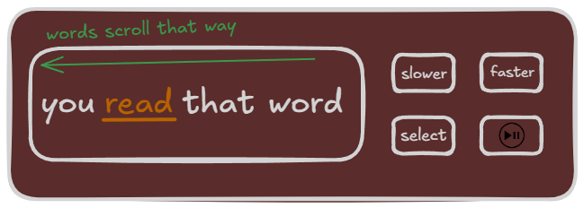
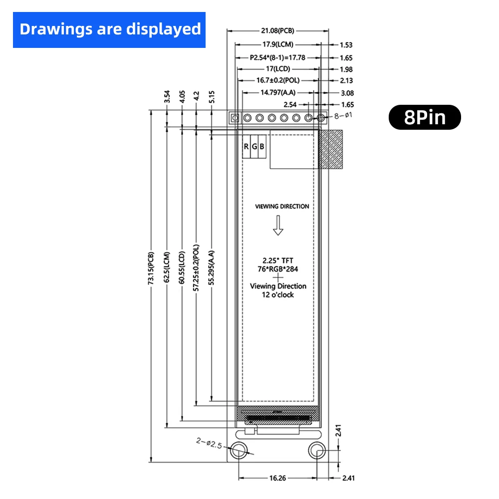
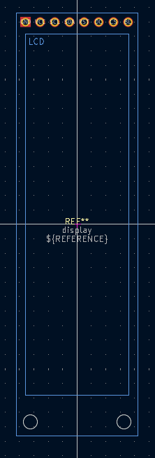
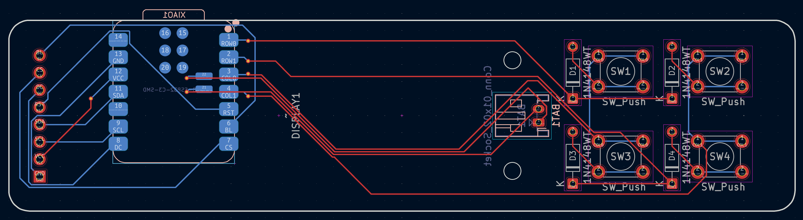
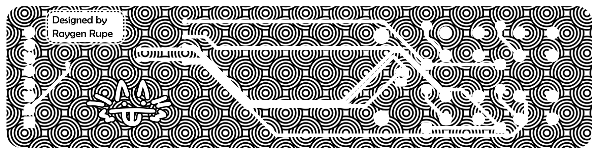
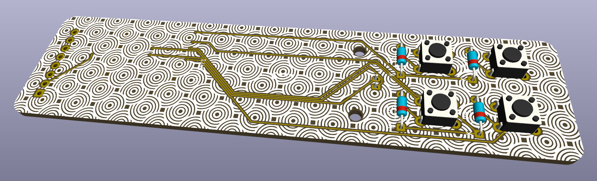
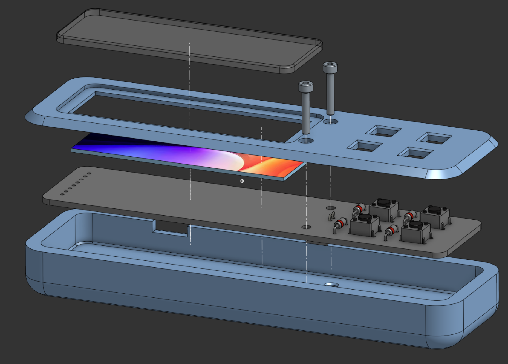
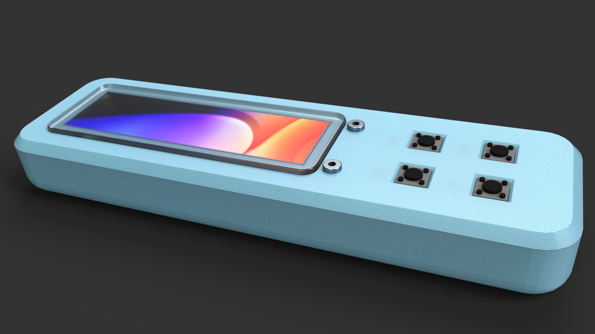

# JOURNAL

## the beginning - 2 hours

[This](https://www.youtube.com/watch?v=dZYVJu6VOJw) is ReadGood. It's a project made during Hack Club's Undercity event, a hackathon I went to. See more here: [text](https://undercity.hackclub.com/).

The whole idea behind the project was "haha 1 word kindle is kinda funny". Except, as Will ended up learning, it lets you read things surprisingly fast.

This is a real thing! It's called Rapid Serial Visual Processing. Essentially, just give your brain all the words in serial, rapidly and you read faster. I think this is amazing and I want one of my own.

I spent about ten to fifteen minutes just tinkering around in Excalidraw, trying to find a layout I liked for the device. I came up with this:

There's a large, horizontal bar screen on the left with 4 control buttons on the right side. The upper two buttons are used for controlling the speed, while the bottom 2 are for selecting the text you want to read and playing/pausing the device.

### then things got annoying

Turns out screens are hard to find in this shape? It took me a genuine half hour of searching before finding [this thing](https://www.aliexpress.us/item/3256809079738832.html). I spent a while avoiding this specific screen because it has NO 3D MODEL AVAILABLE ANYWHERE ON THE INTERNET. Just this surprisingly hard to read technical drawing:

Eventualy I gave up and just went with this one. This meant I got to make my own KiCad symbol and footprint, which was definitely not horrible and definitely wa so much fun (i'm lying).

I eventually created the above footprint. I've never made a footprint in KiCad before, so it took me quite a long while to make everything work and the dimensions correct. I'm still not sure they're correct, honestly. I think it is though, which means something.

# route route route route route - 1.5 hours

Routing time!

Here's the design I came up with. The Xiao goes on the back side, along with the connector for the battery. The buttons and their resistors are then on the front. This was honestly pretty easy to do, I only had to re-route the entire thing twice (a personal record)!

You'll notice that this is pretty empty, though. I thought about trying to fit some neopixels, an sd card reader, something else in to fill the space up. I didn't really like any of those ideas a whole lot, though

# the reign of silkscreen - 3 hours

This took so, so long.

A while back I saw a PCB with this really really neat silkscreen pattern applied on top. I decided to do the same.

Looking around on Youtube I tried to figure out how to make a pattern in Inkscape and saw this really cool circle thing. I still dont' know how it works but it sure does look neat!

This took me an insane amount of tries to get right. I've exported dxf's from Kicad about 25 times trying to figure out what settings to tweak to actually import it correctly. I didn't want to just import a pattern and have it go over the whole thing--I decided to import the actual traces, holes, vias, etc so I could exclude those from the pattern and make them a little bolder looking.

It came out nicely, though:

I like the look it gives to the traces. I'm really tempted to try and get it made out of copper but I can't figure out how to make Kicad use it as anything other than silkscreen.

# CAD time - 1 hour

The CAD for this was easy, but a bit tedious. Here's the full assembly:

This sandwiches the PCB between 2 FDM printed pieces and a glued-in laser cut acrylic plate protects the display. Simple, but solid.

I also made a nice little render with Onshape's Render Studio:

Took about 10 minutes to configure everything and it still looks a little weird, but I like the FDM effect it let me apply. Kinda neat.

# thankies - 0.5 hour

I spent a while building out the BOM in the readme along with this journal. Overall it's taken me 8 hours to design and ship this little project. I'm happy with that! It's going to connect to a small web server I'll be writing and hosting on Cloudflare Workers later, which will sync texts into it's flash memory. This might end up being a half-decent remote for my lights if I get bored of reading.